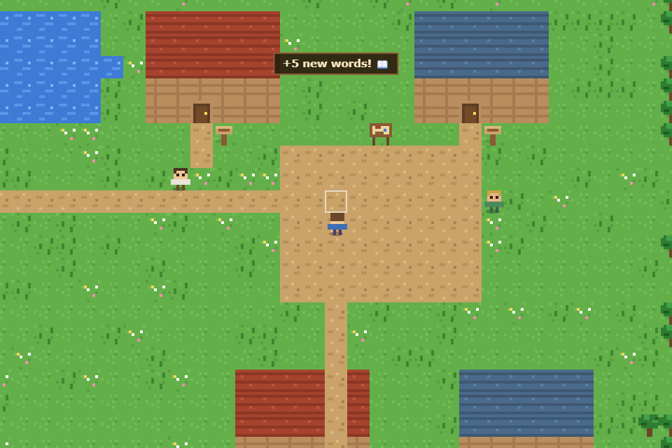
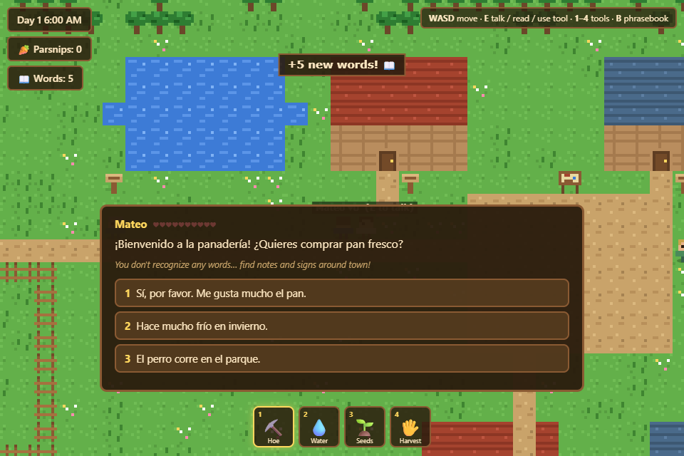
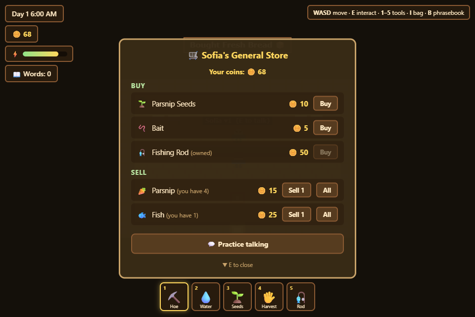
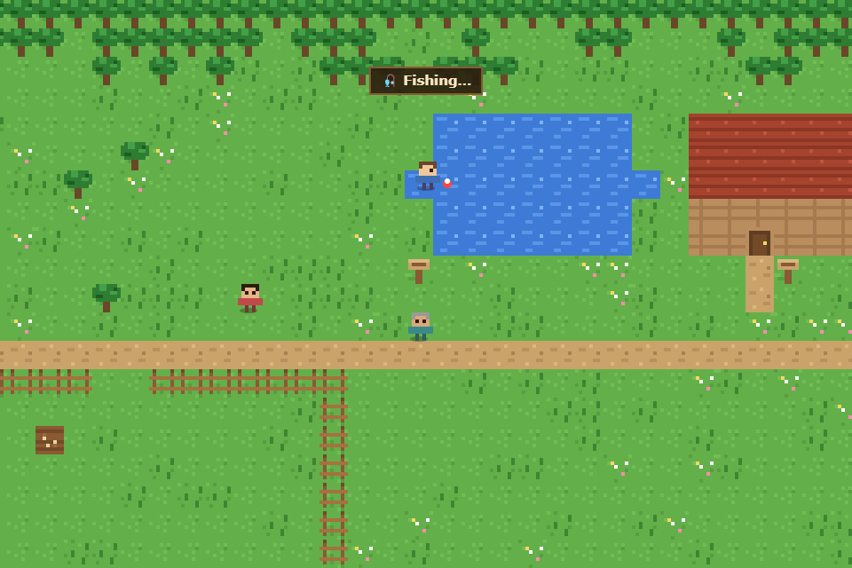

# 🌾 Willow Creek Farm

A cozy, Stardew Valley–inspired farming game that teaches you a language while you play.
The villagers only speak the language you're learning — explore the valley, find notes and
signs to build your phrasebook, and choose your words carefully in conversation to grow
your friendships.



## 🚀 How to play

### ▶ [Play it in your browser](https://hwoudenberg99.github.io/willow-creek-farm/)

No download needed — the game runs right on GitHub Pages, and your progress
autosaves in your browser.

### Or run it locally

The game is plain HTML5/JavaScript and runs offline in any modern browser.

1. Download the latest release zip (or clone this repo)
2. Extract it anywhere
3. Open `index.html` in your browser — that's it!

Prefer a local server? With Node.js installed:

```bash
node serve.js
```

then visit http://localhost:8123.

## 🗣️ Language learning

- **Pick your language** at the start: 🇪🇸 Spanish, 🇫🇷 French, or 🇩🇪 German
- **Find notes & signs** around the valley — each one teaches new vocabulary for your phrasebook (press `B` to review)
- **Talk to villagers** — they speak only in your target language. Words you've already learned are translated under their dialogue
- **Choose your reply** from multiple options. Only the answer that actually fits the conversation raises that villager's friendship ♥ — and either way, you're shown what you said in English so you learn from mistakes



## 🚜 Life in the valley

- **Farm**: till the soil, plant parsnip seeds, keep them watered through four growth stages, and harvest
- **Village**: walk east to the plaza — enter the bakery, the general store, and the cottages
- **Economy**: sell parsnips and fish at Sofia's store, buy seeds, bread, bait, and a fishing rod
- **Fishing**: once you own a rod and bait, cast into the pond and wait for a bite 🎣
- **Energy**: working the land costs energy — eat bread, parsnips, or fish to recover, or rest overnight
- **Day/night cycle** with a full in-game clock
- **Autosave**: progress is saved in your browser every few seconds — pick **Continue** on the title screen to resume right where you left off

| Shopping | Fishing |
|---|---|
|  |  |

## 🎮 Controls

| Key | Action |
|---|---|
| `WASD` / arrows | Move |
| `E` / `Space` | Talk, read, enter buildings, use tool |
| `1`–`5` | Select tool (hoe, water, seeds, harvest, rod) |
| `1`–`3` | Pick a dialogue answer |
| `I` | Open your bag (eat food here) |
| `B` | Open the phrasebook |
| `Esc` | Close panels |

## 🛠️ Tech

Zero dependencies — vanilla JavaScript and a single `<canvas>`. All pixel art is drawn
procedurally in code (no image assets), and all dialogue and vocabulary live in
[`js/lang.js`](js/lang.js), so adding a new language is just a matter of adding
translations there.

```
index.html      game shell & UI panels
style.css       UI styling
serve.js        optional zero-dependency dev server
js/
  constants.js  tile ids, prices, energy costs
  lang.js       languages, vocabulary notes, NPC dialogue
  world.js      map generation, interiors, tile sprites, crops
  entities.js   player & villager characters
  main.js       game loop, farming, fishing, shops, dialogue
```
